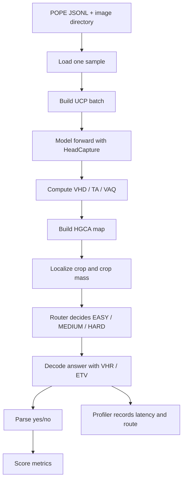

GLIMPSE Pipeline Notes
======================

This document explains the pipeline in a self-contained way: where the input comes from,
what each stage computes, why the intermediate signals exist, and how the final benchmark
metrics are produced.

The core flow is:

1. load a POPE sample from disk
2. build a counterfactual batch around that sample
3. capture internal attention/head signals
4. turn those signals into localization and routing decisions
5. decode the final answer
6. compare the answer to the gold label and record runtime statistics

1. Entry point and control flow

`scripts/run_eval.py` is the top-level runner. It reads command-line arguments such as:

- `--model`
- `--bench`
- `--pope-json`
- `--image-dir`
- `--limit`
- `--alpha-vhr`
- `--out`

Then it creates four main objects:

- `Llava15Adapter`: owns the model, tokenizer, device, and image/text preprocessing
- `GlimpseConfig`: owns router thresholds and decoding parameters
- `GlimpsePipeline`: owns the multi-stage inference logic
- `Profiler`: collects timing and route statistics

For POPE, the script calls `eval.pope.run(...)`. The script itself does not evaluate answers or compute metrics.
It only wires together the model pipeline and the benchmark driver.

2. Data loading from POPE

`eval/pope.py` opens the POPE JSON file and reads one JSON object per line. Each record is expected to contain:

- `image`: the relative image filename
- `text`: the question or prompt
- `label`: the gold yes/no answer

For every sample, it loads the image from disk with:

`PIL.Image.open(os.path.join(image_dir, item["image"]))`

and converts it to RGB.

Important detail: the pipeline does not download data, resolve datasets, or fetch anything from the network.
The benchmark wrapper does local file I/O and passes the loaded image plus question into the pipeline.

3. Input to the model pipeline

Each sample passed into `GlimpsePipeline.run(image, query)` contains only:

- a PIL image
- a natural-language query

At this point the benchmark layer has already done all loading and parsing.
The GLIMPSE pipeline only transforms that image/query pair into a final answer plus diagnostic metadata.

4. Stage 0: Unified Counterfactual Prefill (UCP)

The first stage is `adapter.build_ucp_batch(image, query)`.

This is the most important preprocessing step because it creates the three-view comparison that GLIMPSE relies on.
For LLaVA-1.5, the adapter builds three aligned variants:

- full input: image + question
- no-image input: question only
- no-query input: image + empty assistant prefix

Why this exists:

- full vs no-image shows which heads depend on the visual content
- full vs no-query shows which attention patterns are specifically driven by the question text
- combining these views lets the pipeline separate visual evidence from language priors

The adapter pads the token sequences to a common length and stacks them into one batch.
The visual token positions are kept aligned so the model’s attention maps can be compared across variants.

The batch is then sent through the model once inside `HeadCapture`.
This single forward pass is used to extract all the signals needed by later stages.

5. Capturing internal signals

`glimpse/hooks.py` installs forward hooks on the model’s attention modules.

Two mechanisms matter here:

- `HeadCapture` records per-layer head outputs and attention weights from the UCP forward pass
- `HeadScaler` later reinforces selected heads during decoding

`HeadCapture` is what makes the pipeline explainable: it exposes model internals that are normally hidden.
`HeadScaler` is the control mechanism used after routing, when the pipeline decides which heads deserve extra emphasis.

The captured tensors are then processed by `glimpse/metrics.py`.

6. Stage 0 metrics: turning activations into evidence signals

The captured UCP batch is converted into four main signal types:

- VHD: head-level divergence between full and no-image variants
- TA: activation magnitude on the no-image variant
- pruned VHD: VHD after removing outlier heads
- VAQ: contrastive attention between full and no-query variants

What each one means:

- VHD answers: which heads change when the image is removed?
- TA answers: are some heads spuriously large even without visual input?
- pruned VHD removes heads whose divergence looks like noise rather than useful vision dependence
- VAQ answers: which layers and heads focus on visually relevant patch positions?

These values are all derived from the same UCP forward pass, which keeps the pipeline efficient and consistent.

7. Stage 1: localization

The next step is to turn the attention signals into a spatial crop.
This is done with `glimpse/localize.py` using the VAQ and pruned VHD outputs.

The localization stage computes:

- HGCA: a head-gated contrastive attention map
- crop box: a bounding box centered on the HGCA mass
- crop mass: how much HGCA mass falls inside the crop

Why this exists:

- if evidence is concentrated, a crop can focus the model on the important region
- if evidence is scattered, the crop may matter less
- the crop mass becomes a router feature that tells the system whether cropping is worthwhile

The localization stage returns a `CropResult`:

- `image_pos`: the positive cropped image
- `image_neg`: an optional masked negative crop, used only in HARD mode
- `box`: crop coordinates in original-image space
- `crop_mass`: the scalar evidence-mass feature for routing

This stage bridges attention maps and actual image-space decisions.

8. Stage 2: routing

`glimpse/router.py` turns the UCP-derived signals into route features and then a route decision.

The router features are:

- `d1_depth`: normalized depth of the best VAQ layer
- `d2_entropy`: entropy of the VAQ profile across layers
- `d3_tvhd`: first-token T-VHD
- `d4_crop_mass`: HGCA crop mass

Interpretation:

- a late best layer or high entropy suggests the model’s visual focus is diffuse or harder to localize
- low T-VHD suggests the model may be leaning too much on language priors
- low crop mass suggests the evidence is spread out and a crop may help

`decide(...)` converts those features into one of three routes:

- `Route.EASY`: decode directly, no crop and no negative stream
- `Route.MEDIUM`: crop first, then re-prefill on the crop
- `Route.HARD`: crop, optionally mask evidence, and use ETV decoding with a negative stream

The route is not a label prediction. It is a difficulty-control decision that chooses how expensive and how cautious the next decoding step should be.

9. Stage 3/4: decoding and answer generation

`glimpse/decoding.py` is where the answer text is generated.

The decoding logic keeps VHR reinforcement active during generation.
Depending on the route:

- EASY: the model decodes on the original image
- MEDIUM: the model decodes on the localized crop
- HARD: the model decodes on the localized crop and also uses a negative counterfactual stream

ETV works as follows:

- the positive stream generates tokens normally
- the negative stream is only advanced when the T-VHD proxy falls below the threshold
- when triggered, the negative stream catches up lazily and its logits are combined with the positive logits

Why this design matters:

- it avoids paying the cost of always-on counterfactual decoding
- it keeps the negative stream exact when it is actually needed
- it lets the model spend extra compute only on tokens that look language-prior driven

The final output of decoding is plain text, not a label yet.
That text is later converted into yes/no for POPE scoring.

10. What `GlimpsePipeline.run(...)` returns

`GlimpsePipeline.run(...)` returns a `GlimpseOutput` dataclass containing:

- `text`: the decoded answer string
- `route`: EASY, MEDIUM, or HARD
- `best_layer`: the layer with maximum VAQ
- `tvhd_first`: the first-token T-VHD score
- `etv_stats`: counters describing how often the negative stream was triggered
- `crop_box`: crop coordinates when localization was used

This object is the handoff point between inference and benchmark scoring.
It contains both the visible answer and the internal diagnostics that explain how the answer was produced.

11. Benchmark scoring in POPE

Back in `eval/pope.py`, the answer text is converted into a binary prediction with `parse_answer(...)`.

The parser is intentionally simple:

- trim whitespace
- lowercase the text
- return `yes` if it starts with `yes` or contains ` yes` early in the string
- otherwise return `no`

The benchmark then compares predicted labels to gold labels and computes:

- accuracy
- precision
- recall
- F1
- yes_ratio

How to read them:

- accuracy: overall correctness
- precision: when the model says yes, how often it is right
- recall: among true yes examples, how many the model found
- F1: balance of precision and recall
- yes_ratio: how often the model answers yes at all

In POPE, a high yes_ratio often means the model is overly willing to answer yes, which can improve recall but hurt precision.

12. Efficiency scoring

`eval/profiler.py` records timing and route statistics for each example.

It reports:

- `n_samples`: number of processed examples
- `ms_per_sample_mean`: average wall-clock time per sample
- `ms_per_sample_p50`: median sample time
- `ms_per_token`: average latency divided by generated tokens
- `route_mix`: how many samples were EASY/MEDIUM/HARD
- `etv_utilization_mean`: average fraction of tokens that triggered the negative stream
- `peak_vram_gb`: peak GPU memory usage if CUDA is available

Interpretation:

- `ms_per_sample_mean` and `ms_per_token` tell you how slow the pipeline is
- `route_mix` tells you how the router distributed the workload
- `etv_utilization_mean` tells you how often the expensive negative stream was actually needed
- `peak_vram_gb` is `null` on CPU-only runs

13. How to read your current run

In the run you showed:

- all 100 samples were routed to `medium`
- accuracy was 0.8
- precision was lower than recall, so the model said yes fairly often
- the run was very slow because it used CPU, not CUDA

That output is the combined result of the benchmark wrapper, the GLIMPSE pipeline, and the profiler.

14. End-to-end mental model

If you want to trace a single example from start to finish, the path is:

1. POPE JSON line is read.
2. The image is loaded from disk.
3. The query text is extracted.
4. The adapter builds the UCP batch.
5. The model runs one captured prefill.
6. Hooks record head outputs and attention maps.
7. Metrics are computed from the full/no-image/no-query views.
8. HGCA is used to localize evidence.
9. The router chooses EASY, MEDIUM, or HARD.
10. The decoder generates the answer string.
11. The answer is parsed into yes/no.
12. The gold label is compared.
13. The profiler records timing and route information.

That is the working mechanism of GLIMPSE in this repository.

15. Diagram-style version

Flow chart:

Stage-by-stage inputs and outputs:

| Stage | Input | Output | Purpose |
| --- | --- | --- | --- |
| Data load | POPE JSON line + image filename | PIL image + text query + gold label | Retrieve one benchmark example from disk |
| UCP build | Image + query | Batch of full / no-image / no-query variants | Create counterfactual views for comparison |
| Head capture | UCP batch | Per-layer head outputs and attention maps | Expose internal model signals |
| Metrics | Captured activations | VHD, TA, pruned VHD, VAQ | Quantify visual dependence and attention structure |
| Localization | VAQ + pruned VHD | HGCA map + crop box + crop mass | Find evidence region in the image |
| Routing | VAQ profile + T-VHD + crop mass | EASY / MEDIUM / HARD route | Choose how much extra processing is needed |
| Decoding | Route + image/crop + optional negative stream | Final answer text | Generate the model response |
| Parsing | Final answer text | yes/no prediction | Convert free-form text to benchmark label |
| Scoring | yes/no prediction + gold label | Accuracy, precision, recall, F1, yes_ratio | Measure answer quality |
| Profiling | Route + token count + wall-clock time | Latency stats + route mix | Measure runtime cost |

Compact summary:

- The benchmark loads one image-question pair.
- UCP compares the same example under three counterfactual views.
- Hooks capture attention and head outputs from that batch.
- Metrics turn those activations into localization and routing signals.
- The router chooses how expensive decoding should be.
- The decoder returns text, which is parsed into yes/no for POPE.
- The profiler records how expensive the run was.