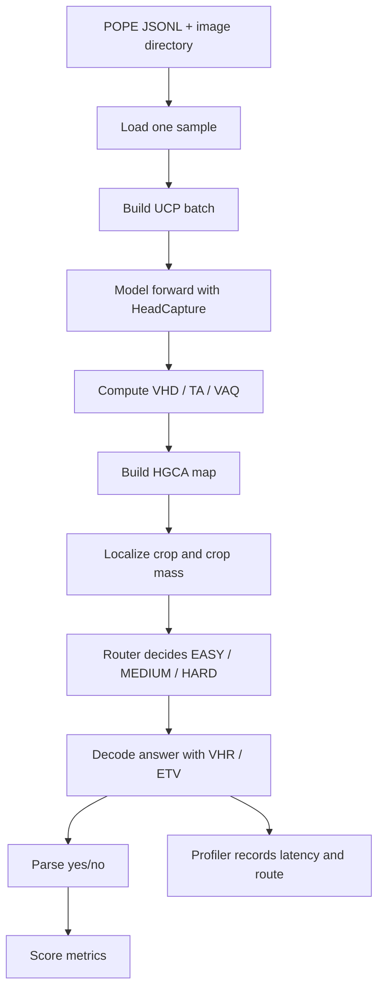

# GLIMPSE Pipeline Documentation

**A Technical Reference for Counterfactual Attention-Based Visual Hallucination Reduction**

---

## Overview

GLIMPSE is an inference pipeline that reduces visual hallucination in vision-language models by comparing internal attention behavior across counterfactual input variants, using the result to localize visual evidence, route examples through adaptive decoding paths, and generate answers with optional contrastive reinforcement.

The pipeline operates as a six-stage flow:

1. Load a POPE sample from disk
2. Build a counterfactual batch around that sample
3. Capture internal attention and head signals
4. Convert signals into localization and routing decisions
5. Decode the final answer
6. Compare the answer to the gold label and record runtime statistics

---

## Table of Contents

1. [Entry Point and Control Flow](#1-entry-point-and-control-flow)
2. [Data Loading from POPE](#2-data-loading-from-pope)
3. [Input to the Model Pipeline](#3-input-to-the-model-pipeline)
4. [Stage 0 — Unified Counterfactual Prefill (UCP)](#4-stage-0--unified-counterfactual-prefill-ucp)
5. [Capturing Internal Signals](#5-capturing-internal-signals)
6. [Stage 0 Metrics — Activations to Evidence Signals](#6-stage-0-metrics--turning-activations-into-evidence-signals)
7. [Stage 1 — Localization](#7-stage-1--localization)
8. [Stage 2 — Routing](#8-stage-2--routing)
9. [Stage 3/4 — Decoding and Answer Generation](#9-stage-34--decoding-and-answer-generation)
10. [Pipeline Output](#10-what-glimpsepipelinerun-returns)
11. [Benchmark Scoring in POPE](#11-benchmark-scoring-in-pope)
12. [Efficiency Scoring](#12-efficiency-scoring)
13. [Reading a Sample Run](#13-how-to-read-your-current-run)
14. [End-to-End Mental Model](#14-end-to-end-mental-model)
15. [Diagram and Stage Reference Table](#15-diagram-style-version)

---

## 1. Entry Point and Control Flow

`scripts/run_eval.py` is the top-level runner. It accepts the following command-line arguments:

| Argument | Purpose |
|---|---|
| `--model` | Specifies the model adapter to use |
| `--bench` | Specifies the benchmark to run |
| `--pope-json` | Path to the POPE dataset JSON |
| `--image-dir` | Path to the image directory |
| `--limit` | Caps the number of samples processed |
| `--alpha-vhr` | VHR reinforcement strength |
| `--out` | Output path for results |

The runner instantiates four core objects:

- **`Llava15Adapter`** — owns the model, tokenizer, device, and image/text preprocessing
- **`GlimpseConfig`** — owns router thresholds and decoding parameters
- **`GlimpsePipeline`** — owns the multi-stage inference logic
- **`Profiler`** — collects timing and route statistics

For POPE evaluation, the script delegates to `eval.pope.run(...)`. The script itself performs no scoring or answer evaluation — it only wires together the model pipeline and the benchmark driver.

---

## 2. Data Loading from POPE

`eval/pope.py` opens the POPE JSON file and reads one JSON object per line. Each record contains:

- `image` — the relative image filename
- `text` — the question or prompt
- `label` — the gold yes/no answer

For each sample, the image is loaded from disk via:

```python
PIL.Image.open(os.path.join(image_dir, item["image"]))
```

and converted to RGB.

> **Note:** The pipeline performs no network access. All data loading and dataset resolution happen locally; the benchmark wrapper reads the image and question from disk and passes them directly into the pipeline.

---

## 3. Input to the Model Pipeline

Each sample passed into `GlimpsePipeline.run(image, query)` consists of only:

- a PIL image
- a natural-language query

All loading and parsing has already occurred at the benchmark layer. The GLIMPSE pipeline's sole responsibility is transforming this image/query pair into a final answer plus diagnostic metadata.

---

## 4. Stage 0: Unified Counterfactual Prefill (UCP)

The first pipeline stage is `adapter.build_ucp_batch(image, query)` — the most critical preprocessing step, as it constructs the three-view comparison underlying the entire GLIMPSE approach.

For LLaVA-1.5, the adapter builds three aligned variants:

| Variant | Composition |
|---|---|
| Full input | image + question |
| No-image input | question only |
| No-query input | image + empty assistant prefix |

**Rationale:**

- Full vs. no-image reveals which attention heads depend on visual content
- Full vs. no-query reveals which attention patterns are driven specifically by the question text
- Combining both views separates visual evidence from language priors

Token sequences are padded to a common length and stacked into a single batch, with visual token positions kept aligned so attention maps remain comparable across variants.

This batch is passed through the model in **one forward pass** inside `HeadCapture`, from which all downstream signals are extracted.

---

## 5. Capturing Internal Signals

`glimpse/hooks.py` installs forward hooks on the model's attention modules. Two mechanisms are central:

- **`HeadCapture`** — records per-layer head outputs and attention weights from the UCP forward pass; this is what makes the pipeline explainable, exposing model internals normally hidden from view
- **`HeadScaler`** — reinforces selected heads during decoding, acting as the control mechanism applied after routing

Captured tensors are then processed by `glimpse/metrics.py`.

---

## 6. Stage 0 Metrics: Turning Activations into Evidence Signals

The captured UCP batch is converted into four signal types:

| Signal | Definition | Answers |
|---|---|---|
| **VHD** | Head-level divergence between full and no-image variants | Which heads change when the image is removed? |
| **TA** | Activation magnitude on the no-image variant | Are some heads spuriously large without visual input? |
| **Pruned VHD** | VHD with outlier heads removed | Which divergence reflects genuine vision dependence rather than noise? |
| **VAQ** | Contrastive attention between full and no-query variants | Which layers/heads focus on visually relevant patch positions? |

All four signals derive from the same UCP forward pass, keeping the pipeline efficient and internally consistent.

---

## 7. Stage 1: Localization

`glimpse/localize.py` converts attention signals into a spatial crop using the VAQ and pruned VHD outputs.

The localization stage computes:

- **HGCA** — a head-gated contrastive attention map
- **Crop box** — a bounding box centered on the HGCA mass
- **Crop mass** — the fraction of HGCA mass falling inside the crop

**Rationale:**

- Concentrated evidence favors a focused crop
- Scattered evidence makes cropping less impactful
- Crop mass becomes a router feature indicating whether cropping is worthwhile

The stage returns a `CropResult` containing:

- `image_pos` — the positive cropped image
- `image_neg` — an optional masked negative crop (HARD mode only)
- `box` — crop coordinates in original-image space
- `crop_mass` — the scalar evidence-mass feature used for routing

---

## 8. Stage 2: Routing

`glimpse/router.py` converts UCP-derived signals into route features, then into a route decision.

**Router features:**

| Feature | Description |
|---|---|
| `d1_depth` | Normalized depth of the best VAQ layer |
| `d2_entropy` | Entropy of the VAQ profile across layers |
| `d3_tvhd` | First-token T-VHD |
| `d4_crop_mass` | HGCA crop mass |

**Interpretation:**

- A late best layer or high entropy suggests diffuse or hard-to-localize visual focus
- Low T-VHD suggests over-reliance on language priors
- Low crop mass suggests spread-out evidence that a crop may help concentrate

`decide(...)` maps these features to one of three routes:

| Route | Behavior |
|---|---|
| `Route.EASY` | Decode directly — no crop, no negative stream |
| `Route.MEDIUM` | Crop first, then re-prefill on the crop |
| `Route.HARD` | Crop, optionally mask evidence, decode with ETV and a negative stream |

The route is a **difficulty-control decision**, not a label prediction — it governs how expensive and cautious the subsequent decoding step should be.

---

## 9. Stage 3/4: Decoding and Answer Generation

`glimpse/decoding.py` generates the final answer text, keeping VHR reinforcement active throughout generation.

**Decoding behavior by route:**

- **EASY** — decode on the original image
- **MEDIUM** — decode on the localized crop
- **HARD** — decode on the localized crop, combined with a negative counterfactual stream

**ETV (Evidence-Triggered Verification) mechanism:**

- The positive stream generates tokens normally
- The negative stream advances only when the T-VHD proxy falls below threshold
- When triggered, the negative stream catches up lazily and its logits are combined with the positive stream's logits

**Design rationale:**

- Avoids the cost of always-on counterfactual decoding
- Keeps the negative stream exact only when actually needed
- Concentrates extra compute on tokens that appear language-prior driven

The output of this stage is plain decoded text — not yet a label. That text is later converted into a yes/no prediction for POPE scoring.

---

## 10. What `GlimpsePipeline.run(...)` Returns

The pipeline returns a `GlimpseOutput` dataclass containing:

| Field | Description |
|---|---|
| `text` | The decoded answer string |
| `route` | EASY, MEDIUM, or HARD |
| `best_layer` | The layer with maximum VAQ |
| `tvhd_first` | The first-token T-VHD score |
| `etv_stats` | Counters describing negative-stream trigger frequency |
| `crop_box` | Crop coordinates, when localization was used |

This object is the handoff point between inference and benchmark scoring, containing both the visible answer and the internal diagnostics explaining how it was produced.

---

## 11. Benchmark Scoring in POPE

Back in `eval/pope.py`, the answer text is converted to a binary prediction via `parse_answer(...)`, which:

1. Trims whitespace
2. Lowercases the text
3. Returns `yes` if the text starts with "yes" or contains " yes" early in the string
4. Otherwise returns `no`

Predicted labels are compared against gold labels to compute:

| Metric | Meaning |
|---|---|
| **Accuracy** | Overall correctness |
| **Precision** | When the model says yes, how often it is correct |
| **Recall** | Among true-yes examples, how many the model identified |
| **F1** | Balance of precision and recall |
| **yes_ratio** | Frequency with which the model answers yes |

> A high `yes_ratio` often indicates the model is overly willing to answer yes — this can improve recall at the expense of precision.

---

## 12. Efficiency Scoring

`eval/profiler.py` records timing and route statistics per example, reporting:

| Metric | Meaning |
|---|---|
| `n_samples` | Number of processed examples |
| `ms_per_sample_mean` | Average wall-clock time per sample |
| `ms_per_sample_p50` | Median sample time |
| `ms_per_token` | Average latency divided by generated tokens |
| `route_mix` | Distribution of EASY/MEDIUM/HARD routes |
| `etv_utilization_mean` | Average fraction of tokens triggering the negative stream |
| `peak_vram_gb` | Peak GPU memory usage (`null` on CPU-only runs) |

**Interpretation:**

- `ms_per_sample_mean` and `ms_per_token` indicate overall pipeline speed
- `route_mix` shows how the router distributed workload across examples
- `etv_utilization_mean` shows how often the expensive negative stream was actually needed
- `peak_vram_gb` is only meaningful on CUDA runs

---

## 13. How to Read a Sample Run

Example run summary:

- All 100 samples were routed to `MEDIUM`
- Accuracy: **0.8**
- Precision was lower than recall, indicating the model answered "yes" fairly often
- Runtime was slow because the run used CPU rather than CUDA

This output reflects the combined result of the benchmark wrapper, the GLIMPSE pipeline, and the profiler.

---

## 14. End-to-End Mental Model

Tracing a single example from start to finish:

1. A POPE JSON line is read.
2. The image is loaded from disk.
3. The query text is extracted.
4. The adapter builds the UCP batch.
5. The model runs one captured prefill.
6. Hooks record head outputs and attention maps.
7. Metrics are computed from the full/no-image/no-query views.
8. HGCA is used to localize evidence.
9. The router chooses EASY, MEDIUM, or HARD.
10. The decoder generates the answer string.
11. The answer is parsed into yes/no.
12. The gold label is compared.
13. The profiler records timing and route information.

---

## 15. Diagram-Style Version

### Flowchart



### Stage-by-Stage Reference Table

| Stage | Input | Output | Purpose |
|---|---|---|---|
| Data load | POPE JSON line + image filename | PIL image + text query + gold label | Retrieve one benchmark example from disk |
| UCP build | Image + query | Batch of full / no-image / no-query variants | Create counterfactual views for comparison |
| Head capture | UCP batch | Per-layer head outputs and attention maps | Expose internal model signals |
| Metrics | Captured activations | VHD, TA, pruned VHD, VAQ | Quantify visual dependence and attention structure |
| Localization | VAQ + pruned VHD | HGCA map + crop box + crop mass | Find evidence region in the image |
| Routing | VAQ profile + T-VHD + crop mass | EASY / MEDIUM / HARD route | Choose how much extra processing is needed |
| Decoding | Route + image/crop + optional negative stream | Final answer text | Generate the model response |
| Parsing | Final answer text | yes/no prediction | Convert free-form text to benchmark label |
| Scoring | yes/no prediction + gold label | Accuracy, precision, recall, F1, yes_ratio | Measure answer quality |
| Profiling | Route + token count + wall-clock time | Latency stats + route mix | Measure runtime cost |

---

### Summary

- The benchmark loads one image-question pair.
- UCP compares the same example under three counterfactual views.
- Hooks capture attention and head outputs from that batch.
- Metrics turn those activations into localization and routing signals.
- The router chooses how expensive decoding should be.
- The decoder returns text, which is parsed into yes/no for POPE.
- The profiler records how expensive the run was.
